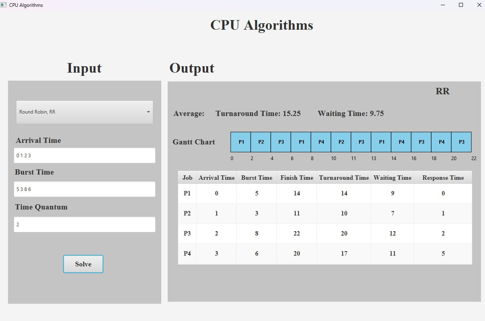
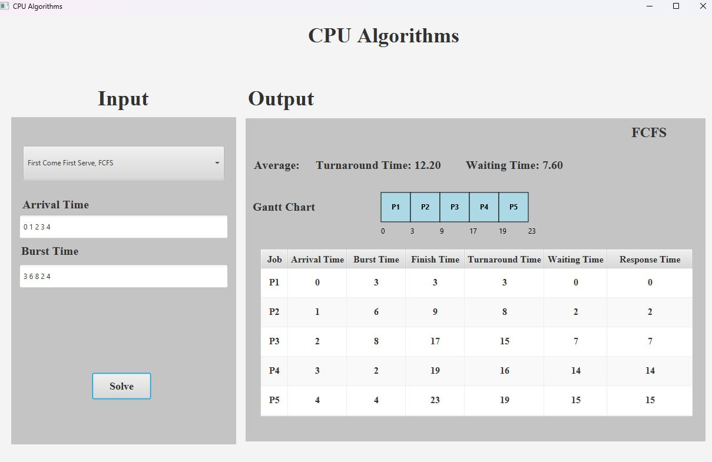

# CPU Scheduling Algorithm Simulator

A JavaFX-based application that simulates and visualizes five fundamental CPU scheduling algorithms used in operating systems.

## Table of Contents

- [Overview](#overview)
- [Features](#features)
- [Algorithms Implemented](#algorithms-implemented)
- [Prerequisites](#prerequisites)
- [Installation & Setup](#installation--setup)
- [How to Run](#how-to-run)
- [Usage Guide](#usage-guide)
- [Sample Input/Output](#sample-inputoutput)
- [Project Structure](#project-structure)
- [Technical Details](#technical-details)
- [Screenshots](#screenshots)

## Overview

This simulator implements five CPU scheduling algorithms and provides visual Gantt charts along with performance metrics including Waiting Time, Turnaround Time, and Response Time. The application features an intuitive GUI that adapts dynamically based on the selected scheduling algorithm.

## Features

- **Interactive GUI** with algorithm selection dropdown
- **Visual Gantt Charts** for all scheduling algorithms
- **Comprehensive Metrics** calculation and display
- **Input Validation** with user-friendly error handling
- **Dynamic Interface** that adapts to selected algorithm requirements
- **Professional Styling** with consistent visual design

## Algorithms Implemented

### 1. First Come First Serve (FCFS)

- **Type**: Non-preemptive
- **Logic**: Processes execute in order of arrival
- **Use Case**: Simple batch processing systems

### 2. Shortest Job First (SJF)

- **Type**: Non-preemptive
- **Logic**: Selects process with shortest burst time among arrived processes
- **Use Case**: Minimizing average waiting time when burst times are known

### 3. Shortest Remaining Time (SRT)

- **Type**: Preemptive
- **Logic**: Continuously selects process with minimum remaining execution time
- **Use Case**: Optimal for minimizing average waiting time in preemptive systems

### 4. Round Robin (RR)

- **Type**: Preemptive
- **Logic**: Each process gets equal CPU time slices (time quantum)
- **Configuration**: User-defined time quantum
- **Use Case**: Time-sharing systems with fair CPU distribution

### 5. Multilevel Feedback Queue (MLFQ)

- **Type**: Preemptive with multiple queues
- **Logic**: Three-queue system with different priorities and time quantums
  - **Queue 1**: Highest priority, user-defined time quantum
  - **Queue 2**: Medium priority, larger user-defined time quantum
  - **Queue 3**: Lowest priority, FCFS scheduling
- **Use Case**: Interactive systems balancing response time and throughput

## Prerequisites

- **Java Development Kit (JDK)** 11 or higher
- **JavaFX SDK** (if not included with JDK)
- **Maven** (for dependency management)
- **IDE** with JavaFX support (IntelliJ IDEA, Eclipse, VS Code)

## Installation & Setup

### Method 1: Using Maven (Recommended)

1. **Clone or download the project files**
2. **Create a Maven project structure**:

   ```
   cpu-scheduler/
   ├── pom.xml
   ├── src/
   │   ├── main/
   │   │   ├── java/com/example/
   │   │   │   ├── App.java
   │   │   │   ├── Controller.java
   │   │   │   ├── Process.java
   │   │   │   └── GanttChart.java
   │   │   └── resources/
   │   │       └── CPU.fxml
   ```

3. **Create pom.xml** with JavaFX dependencies:

   ```xml
   <?xml version="1.0" encoding="UTF-8"?>
   <project xmlns="http://maven.apache.org/POM/4.0.0"
            xmlns:xsi="http://www.w3.org/2001/XMLSchema-instance"
            xsi:schemaLocation="http://maven.apache.org/POM/4.0.0
            http://maven.apache.org/xsd/maven-4.0.0.xsd">
       <modelVersion>4.0.0</modelVersion>

       <groupId>com.example</groupId>
       <artifactId>cpu-scheduler</artifactId>
       <version>1.0-SNAPSHOT</version>

       <properties>
           <maven.compiler.source>11</maven.compiler.source>
           <maven.compiler.target>11</maven.compiler.target>
           <javafx.version>17.0.2</javafx.version>
       </properties>

       <dependencies>
           <dependency>
               <groupId>org.openjfx</groupId>
               <artifactId>javafx-controls</artifactId>
               <version>${javafx.version}</version>
           </dependency>
           <dependency>
               <groupId>org.openjfx</groupId>
               <artifactId>javafx-fxml</artifactId>
               <version>${javafx.version}</version>
           </dependency>
       </dependencies>

       <build>
           <plugins>
               <plugin>
                   <groupId>org.openjfx</groupId>
                   <artifactId>javafx-maven-plugin</artifactId>
                   <version>0.0.8</version>
                   <configuration>
                       <mainClass>com.example.App</mainClass>
                   </configuration>
               </plugin>
           </plugins>
       </build>
   </project>
   ```

### Method 2: Using IDE

1. **Create a new JavaFX project** in your IDE
2. **Copy the source files** to appropriate packages
3. **Configure JavaFX** module path and dependencies
4. **Add FXML file** to resources folder

## How to Run

### Using Maven:

```bash
cd cpu-scheduler
mvn clean compile
mvn javafx:run
```

### Using IDE:

1. **Configure run configuration** with main class: `com.example.App`
2. **Set VM arguments** (if JavaFX not in JDK):
   ```
   --module-path /path/to/javafx/lib --add-modules javafx.controls,javafx.fxml
   ```
3. **Run the application**

### Using Command Line:

```bash
java --module-path /path/to/javafx/lib --add-modules javafx.controls,javafx.fxml -cp target/classes com.example.App
```

## Usage Guide

### Step 1: Select Algorithm

1. **Open the application**
2. **Choose algorithm** from the dropdown menu:
   - First Come First Serve, FCFS
   - Shortest Job First, SJF (Non-Preemptive)
   - Shortest Remaining Time, SRT (Preemptive)
   - Round Robin, RR
   - Multilevel Feedback Queue, MLFQ (3 Queues)

### Step 2: Configure Parameters

**For FCFS, SJF, SRT:**

- Enter **Arrival Times**: Space-separated integers (e.g., "0 1 2 3")
- Enter **Burst Times**: Space-separated integers (e.g., "5 3 8 6")

**For Round Robin:**

- Enter **Arrival Times** and **Burst Times** as above
- Enter **Time Quantum**: Single positive integer (e.g., "2")

**For MLFQ:**

- Enter **Queue 1 Time Quantum**: Integer value
- Enter **Queue 2 Time Quantum**: Integer value (must be > Queue 1)
- Select **Queue 3 Algorithm**: Currently only FCFS available
- Click **Next** to proceed to process input
- Enter **Arrival Times** and **Burst Times**

### Step 3: View Results

1. **Click "Solve"** to execute the simulation
2. **Review Results**:
   - **Gantt Chart**: Visual representation of process execution
   - **Results Table**: Process details and calculated metrics
   - **Averages**: Mean turnaround and waiting times

## Sample Input/Output

### Sample Input

**Processes:**

- P1: Arrival=0, Burst=5
- P2: Arrival=1, Burst=3
- P3: Arrival=2, Burst=8
- P4: Arrival=3, Burst=6

**GUI Input:**

- Arrival Time: `0 1 2 3`
- Burst Time: `5 3 8 6`
- Time Quantum (for RR): `2`

### Expected Output (Round Robin, Quantum=2)

**Gantt Chart Sequence:**

```
P1(0-2) → P2(2-4) → P3(4-6) → P4(6-8) → P1(8-11) → P2(11-12) → P3(12-18) → P4(18-22)
```

**Results Table:**
| Process | Arrival | Burst | Finish | Turnaround | Waiting | Response |
|---------|---------|--------|--------|------------|---------|----------|
| P1 | 0 | 5 | 11 | 11 | 6 | 0 |
| P2 | 1 | 3 | 12 | 11 | 8 | 1 |
| P3 | 2 | 8 | 18 | 16 | 8 | 2 |
| P4 | 3 | 6 | 22 | 19 | 13 | 3 |

**Averages:**

- Average Turnaround Time: 14.25
- Average Waiting Time: 8.75

## Project Structure

```
src/
├── com/example/
│   ├── App.java              # Main application class - JavaFX entry point
│   ├── Controller.java       # UI controller and algorithm implementations
│   ├── Process.java          # Data model for process representation
│   └── GanttChart.java       # Utility class for Gantt chart generation
└── resources/
    └── CPU.fxml              # FXML layout file for UI design
```

### File Descriptions

- **App.java**: Initializes JavaFX application and loads FXML layout
- **Controller.java**: Contains all scheduling algorithm implementations and UI logic
- **Process.java**: Simple data class representing a process with all timing attributes
- **GanttChart.java**: Static methods for generating visual Gantt charts for each algorithm
- **CPU.fxml**: Declarative UI layout with input controls and result display areas

## Technical Details

### Input Format

- **Space-separated integers** for arrival and burst times
- **Single integer** for time quantum values
- **No commas allowed** - application validates and rejects comma-separated input

### Calculations

- **Completion Time**: When process finishes execution
- **Turnaround Time**: Completion Time - Arrival Time
- **Waiting Time**: Turnaround Time - Burst Time
- **Response Time**: Time of first CPU allocation - Arrival Time

### Gantt Chart Features

- **Fixed-width blocks** (50x50 pixels) for consistent visualization
- **Color coding**: Different colors for each algorithm type
- **Time markers**: Displayed below each execution block
- **Process labels**: Centered within execution blocks

### Error Handling

- **Input validation**: Ensures proper format and positive values
- **Length validation**: Arrival and burst arrays must have equal length
- **MLFQ validation**: Queue 2 time quantum must exceed Queue 1
- **User feedback**: Error messages displayed in console



## Screenshots


- Algorithm selection interface
- Input forms for different algorithms
- Sample Gantt charts for each algorithm
- Results table with calculated metrics
- MLFQ configuration interface

## Team member

    Chin Hongnyheng
    Virak Rith
    
